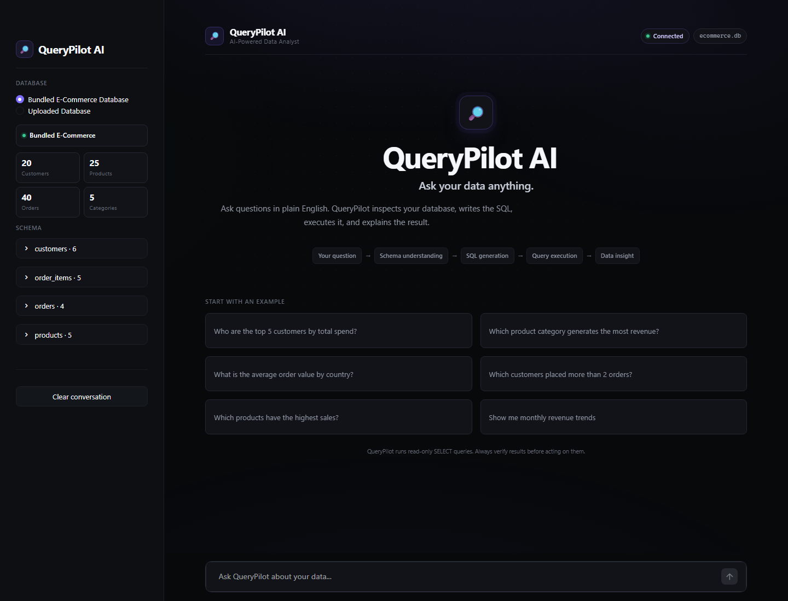

# 🔍 QueryPilot AI

> **Ask your data. QueryPilot does the SQL.**
>
> Ask a question in plain English and QueryPilot inspects the schema, writes the SQL, runs it, and returns a clear answer.



## Overview

A natural language to SQL agent that lets you query an e-commerce SQLite database in plain English, no SQL knowledge required. 

Instead of hardcoding SQL, the agent follows a deliberate three-step process before answering: it loads a SQL skill document for syntax rules and query patterns, inspects the live database schema to confirm column names, then writes and executes the appropriate query. The UI exposes the full activity trace so you can see every tool call, the generated SQL, and its result.

## Features

- **Natural Language Queries:** Ask questions in plain English and the agent figures out the SQL
- **Skill-Based Reasoning:** Agent loads a SQL skill document before writing queries, reducing syntax errors and hallucinations
- **Schema Inspection:** Agent always checks the live schema before querying, never guesses column names
- **Agent Activity Trace:** Every tool call, query, and result is visible in a collapsible Agent Activity panel, with a checklist of the steps the agent actually took
- **Live Progress:** The agent's stages (loading the SQL reference, inspecting the schema, generating and running SQL) stream into the UI as they happen
- **Analyst-Grade Results:** Results render as sortable tables, with metric cards for single-value answers and an optional bar chart when the shape of the data suits one
- **Bundled Dataset:** Ships with a ready-to-use e-commerce SQLite database, no external setup required
- **Bring Your Own Database:** Upload any SQLite `.db` file from the sidebar and the agent will inspect its schema and answer questions against it immediately
- **Example Prompts:** Six one-click starter questions on the welcome screen
- **Dark, Product-Grade UI:** A custom dark theme built on Streamlit's official theming system - no fragile JavaScript overrides

## Tech Stack

**Frameworks & Libraries:**
- [LangChain](https://python.langchain.com/) / [LangGraph](https://langchain-ai.github.io/langgraph/): ReAct agent via `create_agent`
- Tool definitions and LLM integration via `langchain-google-genai`
- [Streamlit](https://streamlit.io/): Interactive web UI with chat interface, themed via `.streamlit/config.toml` plus a scoped stylesheet

**Models (via Google AI / Gemini API):**
- **LLM:** [`gemma-4-26b-a4b-it`](https://ai.google.dev/gemma/docs/core/gemma_on_gemini_api)

**Database:**
- SQLite (bundled sample dataset, auto-generated on first run)

## Dataset

The bundled e-commerce database includes:

| Table | Description |
|---|---|
| `customers` | 20 customers across 10 countries |
| `products` | 25 products across 5 categories |
| `orders` | 40 orders with statuses: pending, processing, shipped, delivered, cancelled |
| `order_items` | 78 line items linking orders to products |

Categories: Electronics, Clothing, Books, Home & Garden, Sports

## How It Works

```
User Question
      │
      ▼
  load_skill('sql')       ← loads syntax rules + query patterns
      │
      ▼
  get_schema()            ← inspects live table/column structure
      │
      ▼
  execute_sql(query)      ← runs the generated SELECT query
      │
      ▼
  Answer + Reasoning Trace
```

**Tools:**
- **`load_skill`**: reads `skills/sql.md`, which contains SQLite syntax rules, common query patterns, and schema reference
- **`get_schema`**: queries `sqlite_master` and `PRAGMA table_info` to return the live database structure
- **`execute_sql`**: runs a read-only query (`SELECT` or `WITH ... SELECT`) and returns a formatted table; writes are rejected

## Prerequisites

- Python 3.12 or higher
- [uv](https://docs.astral.sh/uv/)
- A Google AI Studio API key

## Installation

### 1. Clone the Repository

```bash
git clone <your-repo-url> "QueryPilot AI"
cd "QueryPilot AI"
```

### 2. Set Up Environment Variables

```bash
cp .env.example .env       # Windows PowerShell: copy .env.example .env
```

Open `.env` and add your key:

```env
GEMINI_API_KEY=your_google_ai_studio_key_here
```

Get your API key at [Google AI Studio](https://aistudio.google.com/app/apikey).

### 3. Install Dependencies

```bash
uv sync
```

## Usage

```bash
uv run streamlit run app.py
```

Navigate to `http://localhost:8501` in your browser.

The bundled e-commerce SQLite database is created automatically on first run. No extra setup needed.

To query your own database, select **Upload Your Own** in the sidebar and upload any `.db`, `.sqlite`, or `.sqlite3` file. The agent will inspect the schema automatically and you can start asking questions right away.

**Example questions to try (bundled dataset):**
- "Who are the top 5 customers by total spend?"
- "Which product category generates the most revenue?"
- "What is the average order value per country?"
- "Which customers placed more than 2 orders?"

## Project Structure

```text
QueryPilot AI/
├── app.py              # Streamlit UI, chat interface, and result rendering
├── agent.py            # LangGraph ReAct agent and tool definitions
├── database.py         # SQLite schema and sample data seeder
├── skills/
│   └── sql.md          # SQL syntax rules and query patterns loaded by the agent
├── assets/
│   ├── styles.css      # Component styles for the QueryPilot UI
│   ├── ui-preview.png  # Current UI screenshot (used in this README)
│   └── demo.png        # Original screenshot from the upstream project
├── .streamlit/
│   └── config.toml     # Dark theme tokens (colors, typography, radii)
├── data/
│   └── ecommerce.db    # SQLite database (auto-generated, gitignored)
├── .env.example        # API key template
├── pyproject.toml      # Project dependencies (uv)
└── README.md
```

## Contributing

Contributions are welcome! Please feel free to submit a Pull Request.

## License

This project is licensed under the MIT License. See the [LICENSE](../../LICENSE) file for details.

---

[⬆ Back to Top](#-querypilot-ai)
